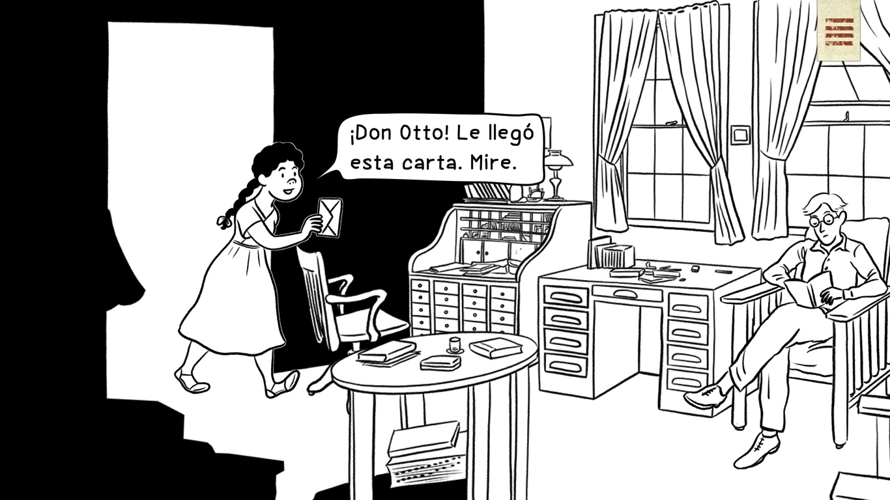

<!DOCTYPE html>
<html manifest="index.hyperesources/cache.manifest">
  <head>
	<meta http-equiv="Content-Type" content="text/html; charset=utf-8" />
	<meta http-equiv="X-UA-Compatible" content="chrome=1,IE=edge" />
	<title>El viaje de Otto</title>
	
	<!-- copy these lines to your document head: -->

	<meta name="viewport" content="user-scalable=yes, width=1366" />
	
	
	

	<!-- end copy -->
  </head>
  <body>
	<!-- copy these lines to your document: -->

	

		<noscript>
			
		</noscript>
		
	

	<!-- end copy -->
	

	<!-- text content for search engines: -->

	

		
Créditos

		

		
avanceMÚsIca

		
ElVIAJE

		
Leer

		
DE OTTO

		
andrezzinho & andrea sazu

		
Esa tarde sofocante, como todas en la ciudad de Honda, Josefa le entregó a don Otto una carta que había recibido en la oficina de correos proveniente del Brasil. Al menos por lo que pude entrever en su estampilla finamente pegada en la esquina derecha: una playa con mar y unas montañas extrañas dibujadas al lado de las palabras Brasil Correio.

		
Capítulo 1

		
Honda_compressed

		
¡Don Otto! Le llegó
esta carta. Mire.

		
honda, 1928

		
SCROLL

		
Querido Amigo,

Espero que recibas esta carta en la mejor condición de salud. Estos días he recordado con cariño mi tiempo pasado en Colombia. Ando un poco nostálgico recordando los paisajes americanos desde las fotografías que he recogido en este largo caminar. ¿Has logrado descubrir algo sorprendente en tus pesquisas? Imagino que sí, pues noticias me han llegado de que estás muy bien asentado en la ciudad de Honda. Estás haciendo tu parte en mantener las relaciones de amistad y buen trato con las jóvenes naciones americanas.

Te cuento que he decidido regresar a Alemania. Ya sabes cómo son las cosas con Emilda, va y viene entre esa oscura tristeza que la agarra de la nada y no la deja ni cocinar. Además, hay rumores de una guerra próxima y me afana llegar. Quiero ver la nieve, comer el delicioso Strudel que preparan en casa de la tía Anna, y sobretodo ver si Emilda mejora.

Parto mañana desde el puerto de Belém do Pará y quisiera pedirte, mi estimado Otto, que hagas llegar el baúl que te encargué a mi dirección. Cuidalo mucho, sabes lo importante que es para mí.

Sin más que los mejores deseos, de quien te recuerda siempre, me despido.

Arnold.

		
Claro que sí Don
Otto, ya lo busco...

		
Vamos a viajar
Antonio y yo.

		
¿¡vamos a viajar usted y yo!?

		
Josefa, tenemos que salir mañana mismo para Ambalema, y luego tomar el vapor Junín. Prepara el equipaje para un mes de viaje y llama a Antonio.

		
LA DORADA

		
PUERTO NARE

		
EPÍLOGO

		
INICIO

		
MOMPOX

		
HONDA

		
BARRANQUILLA

		
AMBALEMA

		
Además en Ambalema
tengo una prima cercana

		
 ¡Yo podría enseñarle a hablar mejor el español!

		
¿Qué le dijo Don Otto?
¿Por qué no me lleva?

		
No me dijo nada, no sé el contenido de la carta. Lo que sí me pidió fue recoger el cofre del señor Arnold, el que tenemos en las bodegas de Ambalema.

		
Yo le cambiaría mi lugar de buena gana. El joven Otto es callado, aburrido y este viaje será tan largo que no me emociona nada nada.

		
¡Ay Josefa!
usted si es bien inocente...

		
No entiendo por qué no puedo ir.
Yo podría estar pendiente de la ropa y de la comida del Joven Otto.

		
Es callado porque no habla bien español y viene de unas tierras muy diferentes.

		
Esos quince días de travesía hasta el mar, atravesando el Río Magdalena, significaban los más indecibles padecimientos provocados por la navegación y la salvaje naturaleza, especialmente para un extranjero como el joven Otto con esa piel tan blanca y proclive a los mosquitos. A pesar de eso, Josefa estaría más que feliz de ir y compartir con él ese infierno que nos esperaba.

		
Este libro fue posible gracias a:

		
El viaje de Otto es una historia creada por Andrea Sazu y Andrezzinho.
Música original de Carlos Dudley Sandoval.

		
El joven Otto nunca se podría enamorar de usted, empezando porque usted, como yo, es pobre y mulata.

		
¡Quién quita! Soñar no cuesta nada... 

		
¡Acuérdese de la historia de Tomasa!

		
Esa historia no se va a repetir nunca,
¿acaso usted no supo cómo terminó?

		
El joven
Otto nunca le haría nada
malo a nadie.

		
No…

		
Y no quiere saberlo. Mejor ocúpese de otra cosa Josefa. 

		
Espéreme aquí mientras compro los tiquetes.

		
y oigame: una mujer bonita como usted no tiene que sufrir por ese hombre, consigase uno de acá que la quiera y la haga feliz, créame, el Joven Otto no es para usted.

		
Josefa se quedó en Honda cuidando de la casa. Soñaba despierta con encuentros inverosímiles en los que Otto la besaba y le confesaba su amor. Mientras tanto, el tren atravesaba lentamente el puente sobre el río y nos llevaba a iniciar el viaje en Ambalema, para tomar del baúl secreto del señor Arnold.

Observé a mi lado derecho al señor Otto, quien garabateaba extensos párrafos en su cuaderno con su pluma negra.

		
VOLVER AL INICIO

	

	<!-- end text content: -->

  </body>
</html>
